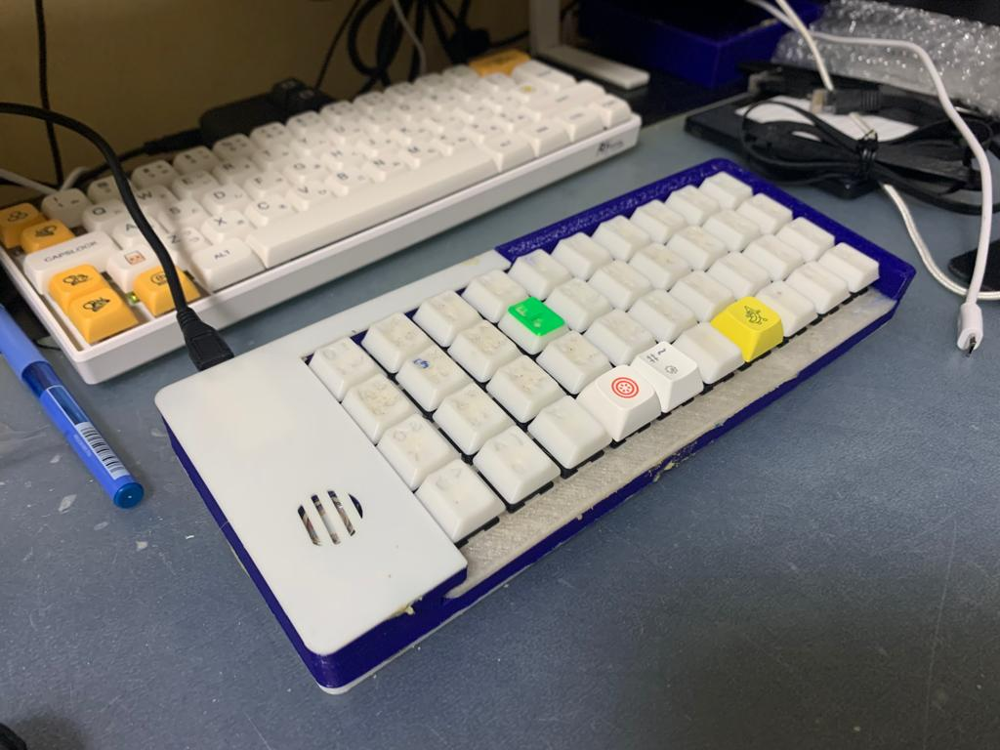

# jerickkb
this is jerick's first keyboard!

[link to 3d model](https://cad.onshape.com/documents/3e659bc1ec258d39c41bef2a/w/ca20a009caa1a73094be2e16/e/844abdcb8c6c0b7e9a9535bb?renderMode=0&uiState=62a4b3cb4ab0eb4b7fb1a9aa)

# layout
|layer 0||||||||||
|---|---|---|---|---|---|---|---|---|---|
|Q| W| E| R| T| Y| U| I| O| P| 
|A| S| D| F| G| H| J| K| L| ENT| 
|LSFT| Z| X| C| V| B| N| M| COMM| DOT| 
|LGUI| LCTL| LALT| BSPC| SPC| SPC| MO(1)| MO(2)| TAB| BSPC|

|layer 1||||||||||
|---|---|---|---|---|---|---|---|---|---|
|1| 2| 3| PLUS| MINUS| TRNS| GRAVE| RBRC| LBRC| BSLASH| 
|4| 5| 6| ASTERISK|SLASH | DOLLAR| SCOLON| RPRN| LPRN| ENT| 
|MT(MOD_LSFT, 7)| 8| 9| EQUAL| PERCENT| AMPERSAND| QUOTE| RCBR| LCBR| ESC| 
|MT(LGUI,DOT)| MT(MOD_LCTL,0)| LALT| BSPC| SPC| SPC| MO(1)| MO(2)| TRNS| BSPC|

|layer 2||||||||||
|---|---|---|---|---|---|---|---|---|---|
|WAKE| TRNS|TRNS| RESET| SAVE|RANDOMISE TONES| TONE DOWN| TONE UP|TOGGLE TONE | DF(3)| 
|MPRV| MPLY| MNXT| | | | LEFT| UP| DOWN| RIGHT| 
|LSFT| | VOLU| VOLD| | | | | | | 
|LGUI| LCTL| LALT| BSPC| SPC| SPC| MO(4)| MO(2)| TAB| BSPC|

|layer 3||||||||||
|---|---|---|---|---|---|---|---|---|---|
|STN_S1|  STN_TL|  STN_PL|  STN_HL|  STN_ST1| STN_FR|  STN_PR|  STN_LR|  STN_TR|  STN_DR |
|STN_S2|  STN_KL|  STN_WL|  STN_RL|  STN_ST2| STN_RR|  STN_BR|  STN_GR|  STN_SR|  STN_ZR |
|XXXXXXX| XXXXXXX| XXXXXXX| XXXXXXX| XXXXXXX| XXXXXXX| XXXXXXX| XXXXXXX| XXXXXXX| XXXXXXX|
|XXXXXXX| XXXXXXX| STN_A|   STN_O|   XXXXXXX| STN_E|   STN_U|   XXXXXXX| XXXXXXX| DF(0)|

|layer 4||||||||||
|---|---|---|---|---|---|---|---|---|---|
|F1|F2|F3|F4|F5|F6|F7|F8|F9|F10| 
|F11|F12||||||||| 
||||||||||| 
||||LALT(LCTL(DEL))|||||||
# Features
- sound!
- save prefrences!
- no need to remember which layer you are at!
- mouse!
- steno mode!
- relatively ergonomic layout!
# photos

